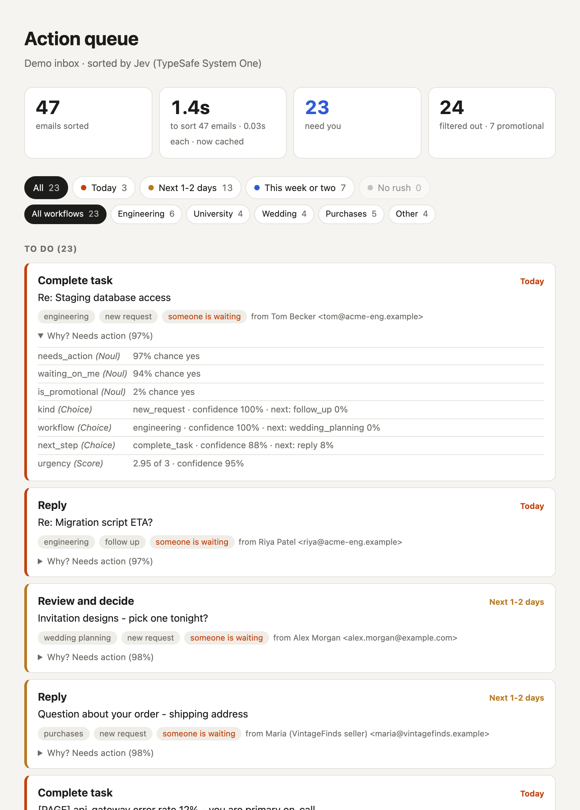
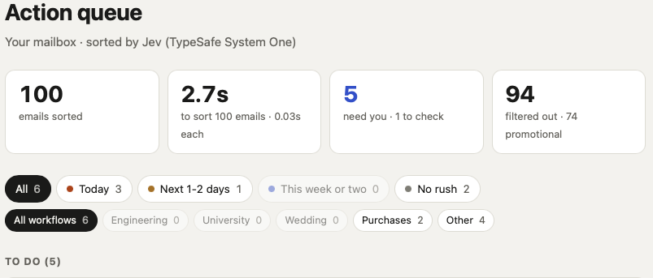

# Jev Inbox Queue

**Stop re-reading your inbox.** [Jev](https://docs.typesafe.ai), TypeSafe's System One model,
turns it into a short action queue: what needs you, how urgent it is, and the next step.



## The problem

Most of an inbox is newsletters, receipts and "we received your documents" messages. The few
emails that need you are mixed in with them, so you keep re-reading everything to find them.
This project reads each email thread once, and shows only the ones that need you.

## How it works

Jev doesn't write text. It answers small, typed questions with probabilities. Each email thread
gets **seven questions in one request**, answered in parallel:

| Question | Type | Used for |
| --- | --- | --- |
| Do I still need to do something? | **Noul** (probability of yes) | Enters the queue |
| Is a person waiting on me? | **Noul** | "Someone is waiting" tag, priority |
| Is it promotional or bulk mail? | **Noul** | Filtered out |
| New request, follow-up, acknowledgement, information or promotional? | **Choice** (one of a set) | Tag, tie-breaker |
| Engineering, university counselling, wedding planning, purchases or other? | **Choice** | Workflow filter |
| Next step: reply, send document, pay, schedule, review, task, none | **Choice** | Card title, e.g. "Submit requested document" |
| How urgent? (no rush → today) | **Score** (ordered levels) | Urgency filter, sort order |

```
email thread ──► Jev (7 answers) ──► policy.py (plain Python rules) ──► To do / Check these / Filtered out
```

Jev makes the judgments; the rules stay in code (`inbox_queue/policy.py`). For example, an email
goes in the queue when `needs_action ≥ 0.6`, and anything with `is_promotional ≥ 0.5` is filtered out.
Answers are cached, so changing a rule never needs new API calls.

## Results

**Demo inbox:** 47 hand-written, hand-labelled emails (`data/demo_inbox.json`), 23 of which need action.

| Measure | Result |
| --- | --- |
| Actionable emails missed | 0 of 23 |
| Irrelevant emails shown | 0 of 23 |
| Promotional question correct | 47 of 47 |
| Time to sort all 47 | 1.4 s (5 requests at a time) |

To be honest about these numbers: I wrote the emails and the labels myself, and I adjusted one rule
(the promotional filter) after looking at the results. Your own inbox is the real test.

**My real inbox:** 100 emails sorted in 2.7 seconds. 5 need me, 1 to check, and 94 filtered out,
74 of them promotional.



## Quick start

Needs Python 3.10+, [uv](https://docs.astral.sh/uv/) and a TypeSafe API key from
[console.typesafe.ai](https://console.typesafe.ai/).

```sh
git clone https://github.com/tusharck/jev-inbox-queue.git
cd jev-inbox-queue
uv sync
cp .env.example .env                        # then add your TYPESAFE_API_KEY
uv run python -m inbox_queue demo           # opens the queue for the fake inbox
uv run python -m inbox_queue evaluate       # missed / irrelevant counts, per-question accuracy
```

Try different rules for free, using the cached answers:

```sh
uv run python -m inbox_queue evaluate --high 0.5 --low 0.2
```

## Use your own Gmail

1. Turn on [2-Step Verification](https://myaccount.google.com/security), then create an
   [app password](https://myaccount.google.com/apppasswords).
2. In `.env`, set `IMAP_USER` (your address) and `MY_NAME` (so Jev knows which messages are yours).
3. Save the app password to your system keychain. It's typed into a hidden prompt, not stored in a file:
   ```sh
   uv run python -m inbox_queue save-password
   ```
4. Run it:
   ```sh
   uv run python -m inbox_queue imap --days 3 --limit 10   # start small
   uv run python -m inbox_queue imap                       # defaults: last 7 days, up to 40 threads
   ```

It reads **All Mail**, which includes your sent replies, so Jev can see what you've already answered.
It opens the mailbox read-only, never marks anything as read, and makes one Jev request per thread.

## What I learned about Jev

- **Ask a dedicated yes/no question.** Filtering promotions by how confident the "message kind"
  Choice was failed on a borderline email (89% vs a 90% cut-off). A separate `is_promotional` Noul
  split the emails cleanly: every promotion scored 0.53 or higher, every other email 0.20 or lower.
- **Answers vary a little between runs.** An email close to a cut-off can land on either side, so
  add a "check these" band instead of trusting one number.
- **Only judge answers where they're used.** "Next step" looked weak (33/47) until I counted only
  the emails that need action (22/23). For the rest, Jev still suggests a step, which the app never shows.
- **Selecting beats generating.** The card title comes from a fixed list chosen by a Choice question,
  so it's always short and consistent.

## Project layout

| File | What it does |
| --- | --- |
| `inbox_queue/questions.py` | The seven questions sent to Jev |
| `inbox_queue/classify.py` | Calls the TypeSafe API, 5 at a time, and caches answers in `.cache/` |
| `inbox_queue/policy.py` | Rules that turn answers into To do / Check these / Filtered out |
| `inbox_queue/sources.py` | Loads the demo inbox, or your mailbox over IMAP |
| `inbox_queue/render.py` | Builds the HTML page in `out/` |
| `inbox_queue/evaluate.py` | Measures results against the demo labels |
| `data/demo_inbox.json` | 47 fake, labelled email threads |

## Privacy

- Email text is sent to the TypeSafe API to be classified.
- Your API key stays in `.env`, and your mail password stays in the system keychain.
- `.env`, `.cache/` (Jev's answers) and `out/` (the generated page) are git-ignored and stay on your machine.

## Ideas

- Draft replies with a writing model for "Reply" items
- Google sign-in (OAuth) instead of an app password
- Your own workflows and next steps: edit `inbox_queue/questions.py`

## License

[MIT](LICENSE)
